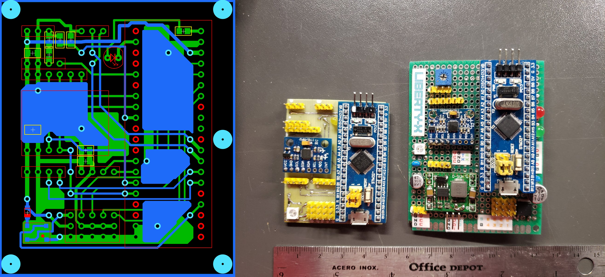
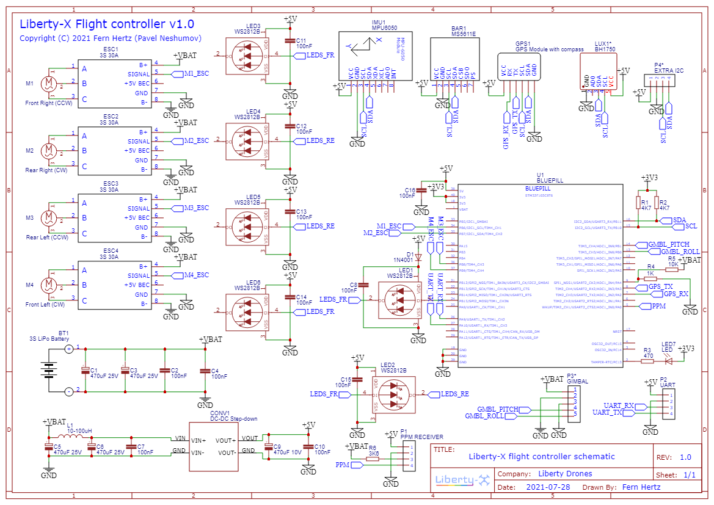

# Liberty-X Flight Controller

----------

This project is currently a firmware for a flight controller based on an STM32 microcontroller. This flight controller is suitable for camera drones, scientific drones or delivery drones (as part of the AMLS project)

This project is currently part of the AMLS (Autonomous Multicopter Landing System) project. The AMLS project was created as a part of project activities subject of Moscow Polytech University by the 181-311 group

This project is a fork of the YMFC-32 project

The project is under development. Description, PCB files, schematics, OSD, etc. coming soon

----------

----------

## AMLS Projects:

- **Liberty-Way Project:** https://github.com/XxOinvizioNxX/Liberty-Way
- **Eitude Project:** https://github.com/XxOinvizioNxX/Eitude
- **PX4 UDP Connection Project:** https://github.com/Draskown/PX4_UDP_Connection

-----------

## Feedback
- Developer: Fern Lane
- E-Mail: xxoinvizionxx@gmail.com
- GitHub: https://github.com/XxOinvizioNxX
- Twitter: https://twitter.com/frey_hertz

## For project development:
- BTC: `bc1qd2j53p9nplxcx4uyrv322t3mg0t93pz6m5lnft`
- ZEC: `t1Jb5tH61zcSTy2QyfsxftUEWHikdSYpPoz`
- ETH: `0x284E6121362ea1C69528eDEdc309fC8b90fA5578`
- XCH (CHIA): `xch1dnm87ennt63sssnmzzmh8ggf3s2jjxd6pt4rhkzyhg4tyfhah0ts43zkct`

-----------

## Logotype
Liberty-X logo was designed by Fern Lane

-----------

## Dependencies
- **Arduino STM32** (Arduino code support for STM32): https://github.com/rogerclarkmelbourne/Arduino_STM32
- **WS2812B** (Library for WS2812B LEDs): https://github.com/rogerclarkmelbourne/WS2812B_STM32_Libmaple
